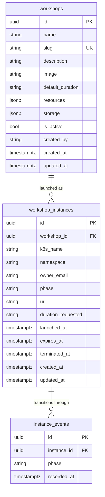

Orchestra uses a PostgreSQL database to persist workshop templates and instance records.
The Kubernetes CRD is the live runtime representation; the database holds history,
ownership, and utilization data that the cluster does not track.

## Entity-Relationship Diagram



## Tables

### `workshops` (templates)

Stores the reusable template configuration created and managed by admins.

| Column | Type | Notes |
|---|---|---|
| `id` | UUID PK | |
| `name` | string | Human display name |
| `slug` | string UNIQUE | k8s-safe prefix; used to generate instance names |
| `description` | string nullable | |
| `image` | string | Docker image (e.g. `rocker/rstudio:latest`) |
| `default_duration` | string | e.g. `"4h"` |
| `resources` | JSONB | `{cpu, memory, cpuRequest, memoryRequest}` |
| `storage` | JSONB nullable | `{size, storageClass}` |
| `is_active` | bool | `false` = archived; not launchable |
| `created_by` | string | Email of the admin who created it |

### `workshop_instances`

One row per launch. Created when a user launches from a template; updated on
each API read as phase/url are synced from the live k8s CRD.

| Column | Type | Notes |
|---|---|---|
| `id` | UUID PK | |
| `workshop_id` | UUID FK | → `workshops.id` (NOT NULL) |
| `k8s_name` | string | CRD name in k8s, auto-generated as `{slug}-{6 chars}` |
| `namespace` | string | Kubernetes namespace |
| `owner_email` | string | User who launched the instance |
| `phase` | string | Mirrors k8s `status.phase` |
| `url` | string nullable | Populated by operator via ingress |
| `duration_requested` | string | Duration override or template default |
| `launched_at` | timestamptz | When the DB record and CRD were created |
| `expires_at` | timestamptz nullable | Set when k8s operator writes expiry to status |
| `terminated_at` | timestamptz nullable | Set on DELETE or when CRD is gone from k8s |

### `instance_events`

Append-only log of phase transitions. Each row records the phase the instance
entered and when. Used to compute time-in-phase utilization.

| Column | Type | Notes |
|---|---|---|
| `id` | UUID PK | |
| `instance_id` | UUID FK | → `workshop_instances.id` |
| `phase` | string | Phase transitioned INTO |
| `recorded_at` | timestamptz | Wall-clock time of the transition |

## Status Sync Strategy

Phase and URL are written by the Kubernetes operator into the CRD status field.
Rather than running a background sync daemon, the API syncs on-demand:

1. `GET /instances/{name}` loads the DB record then calls `k8s.get_workshop()`.
2. If `phase` or `url` changed, the DB row is updated and an `InstanceEvent` is appended.
3. `DELETE /instances/{name}` deletes the k8s CRD and sets `terminated_at`, appending
   a final `Terminating` event.

This gives eventual consistency with a single read latency per API call and no
additional infrastructure.

## Utilization Calculation

Utilization is derived from `instance_events` at query time — no aggregation table is
maintained. For a given instance the API walks consecutive event pairs:

```
time_in_phase[events[i].phase] += events[i+1].recorded_at - events[i].recorded_at
```

For the last (open) event the upper bound is `terminated_at` (if set) or `now()`.
`active_seconds` is the sum of seconds in `Ready` and `Running` phases.

See `GET /instances/{name}/utilization` and `GET /templates/{id}/stats`.
